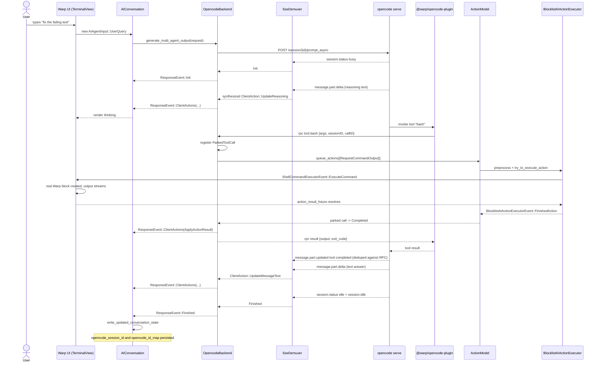

# OpenCode as Primary Agent — TECH.md

Personal-fork integration that replaces Warp's built-in agent decision loop with [opencode](https://opencode.ai) while keeping Warp's UI, blocks, terminal, persistence, and permission model exactly as they are. The user perceives a normal Warp agent session; opencode runs invisibly underneath.

Scope:

- **Phase 1**: opencode drives turns; Warp executes every tool through its existing executors and UI surfaces (real terminal blocks, real diff-review, real denylist, real approval prompts); conversations persist; legacy Warp backend stays compiled in behind a feature flag.
- **Phase 1 tools shadowed**: `bash`, `read`, `edit`, `write`, `patch`, `glob`, `grep`. Everything else (`webfetch`, `todo`, `task`, `fetch`, `search`, `code`, `skill`, `lsp`, `plan`, future additions) is **default-denied** at the plugin layer.
- **Out of scope**: removing Warp's native agent code (we _bypass_, not delete, to keep upstream rebases cheap); shipping to non-fork users; in-flight turn resume across restart; automatic Beads memory writes.

## Context

### Current Warp agent loop (the seam)

The replacement seam is a single function. There is **no** `AiProvider` / `LlmClient` / `AgentBackend` trait today; the backend is a hardcoded SSE call to Warp's server.

- `app/src/ai/agent/api/impl.rs` — `generate_multi_agent_output(request) -> ResponseStream`. Single call site.
- `app/src/ai/agent/api/{convert_from,convert_to,convert_conversation}.rs` — wire ↔ UI conversion.
- `app/src/server/server_api.rs` — `ServerApiProvider`, hardcoded `reqwest_eventsource` + base64 + prost decode into `warp_multi_agent_api::ResponseEvent`.
- `app/src/ai/blocklist/controller/response_stream.rs` — `ResponseStream::new` is the consumer that drives the conversation forward.
- `app/src/ai/agent/conversation.rs` — `AIConversation { id, task_store, todo_lists, code_review, status, added_exchanges_by_response }`.

### Stream contract (what `ResponseStream` actually consumes)

`ResponseStream` only handles three top-level event kinds:

- `Init` — start of a turn.
- `ClientActions(Vec<ClientAction>)` — every state mutation (new exchange, message added, message updated, action started, action result applied, todo updated, plan updated, …).
- `Finished` — end of a turn (with optional error / cancellation reason).

Conversation state is updated by **applying `warp_multi_agent_api::ClientAction` mutations** in `app/src/ai/agent/conversation.rs` and `app/src/ai/blocklist/history_model.rs`. There is no "append text to message" primitive at the consumer layer — every increment is a `ClientAction`.

### Current tool dispatch

- `crates/ai/src/agent/action/mod.rs` — `AIAgentActionType` enum (28 variants). **`TodoOperation` is not a variant.** Todos are output-message state in `app/src/ai/agent/mod.rs`, not executor actions.
- `app/src/ai/blocklist/action_model/execute.rs` — `BlocklistAIActionExecutor::try_to_execute_action`. Returns `TryExecuteResult::{ExecutedAsync, ExecutedSync, NotExecuted{reason: NotExecutedReason::{NeedsConfirmation, NotReady, WaitingOnSharer}, action}}`. **It does not run a tool to completion synchronously**; it kicks off execution or reports back why it can't.
- `app/src/ai/blocklist/action_model.rs::queue_actions` — the real entry point. Preprocesses every action in a batch, then calls `try_to_execute_available_actions`, which threads through approval, blocked-action UI, denylist enforcement, cancellation, and finally emits `BlocklistAIActionExecutorEvent::FinishedAction { result, conversation_id, cancellation_reason }`.
- `app/src/ai/blocklist/permissions.rs` — `BlocklistAIPermissions::{can_autoexecute_command, can_read_files_with_conversation, can_write_files, can_call_mcp_tool, can_read_mcp_resource, can_write_to_pty}`.
- `app/src/ai/blocklist/block/cli.rs` — blocked-action UI, `CLISubagentAction::{ExecuteBlockedAction, ExecuteAndAutoApprove, RejectBlockedAction, TakeControlOfRunningCommand}`.
- Shell command gold path: `ShellCommandExecutor::execute → ShellCommandExecutorEvent::ExecuteCommand → TerminalView::handle_shell_command_executor_event → view::Event::ExecuteCommand → terminal_manager_util.rs → PtyController::write_command → TerminalModel::start_command_execution_with_ai_metadata → block_list.start_active_block`. Output capture via `ShellCommandExecutor::action_result_future` resolving on terminal-model events.

### Current persistence

- `crates/persistence/src/schema.rs`: `agent_conversations(id, conversation_id, conversation_data, last_modified_at)`, `agent_tasks(id, conversation_id, task_id, task, last_modified_at)`, `ai_queries(...)`, `blocks(... agent_view_visibility, ai_metadata ...)`, `terminal_panes.{conversation_ids, active_conversation_id}`.
- Writes flow through `ModelEvent::UpdateMultiAgentConversation` → `app/src/persistence/agent.rs::upsert_agent_conversation`.
- Hydration: `BlocklistAIHistoryModel::load_conversation_data → load_conversation_from_db → read_agent_conversation_by_id → convert_persisted_conversation_to_ai_conversation → AIConversation::new_restored`.
- `AgentConversationData` (JSON) carries `server_conversation_token`, `forked_from_server_conversation_token`, `parent_agent_id`, `run_id`, `last_event_sequence`. **`server_conversation_token` is consumed by Warp cloud APIs** (`app/src/ai/conversation_utils.rs:15+`, `app/src/ai/blocklist/history_model.rs:1360+`, `app/src/ai/blocklist/history_model/conversation_loader.rs:236+`). Overloading it for an opencode session id would call cloud APIs with garbage — see Persistence section for the chosen alternative.

### opencode integration surface

- `opencode serve` exposes an OpenAPI 3.1 HTTP API + a single global SSE stream at `/event` (server-wide, **not** per-session — events are tagged with `sessionID` and must be demuxed client-side). First event is `server.connected`; heartbeat every 10s.
- Prompt API: `POST /session/:sessionID/prompt_async` (returns `204`; events arrive on `/event`).
- Session creation: `POST /session { parentID?, title?, permission?, workspaceID? }`. State persists in opencode-side SQLite (`SessionTable`, `MessageTable`, `PartTable`).
- Cancellation: `POST /session/:sessionID/abort` (used to abort an in-flight turn).
- Plugins are loaded in-process via Bun. **Same-name custom tool shadows the built-in** (`packages/web/src/content/docs/custom-tools.mdx:82-104`). Plugin context exposes outbound HTTP and persistent connections (codex.ts, opencode-pty as precedent).
- opencode does **not** offer a generic "run tool externally" hook. Shadowing every built-in we want Warp to execute is the only path.

### Beads memory

`bd remember` is a string-keyed KV store on top of an embedded Dolt SQLite. `bd prime --json` returns the current memory snapshot for inclusion in agent context. Treat as **read-mostly persistent agent notes**, not semantic memory.

## Proposed changes

Three components to add. One feature flag to gate the whole thing.

### 1. Code layout (re-layered to respect dependency direction)

Warp's `app` crate already depends on workspace crates; **crates cannot depend on `app`**. Anything that calls Warp's app-side executors must live in `app/`.

```
crates/opencode_transport/                  -- pure transport, no Warp glue
  src/
    lib.rs            -- pub OpencodeClient, pub OpencodeProcess, pub SseDemuxer
    process.rs        -- Supervisor: spawn/restart `opencode serve --port=<random> --plugin-dir=<warp-managed>`
    http.rs           -- typed HTTP client (POST /session, /session/:id/prompt_async, /session/:id/abort, ...)
    sse.rs            -- ONE long-lived /event subscription + demuxer keyed by sessionID
    events.rs         -- typed deserialization of opencode SSE events
    rpc.rs            -- localhost JSON-RPC server framing (UDS where available, TCP+token otherwise)
    schemas/          -- vendored opencode tool schemas (see Risks)

app/src/ai/agent/opencode_backend/          -- Warp glue (lives in app/)
  mod.rs              -- pub generate_multi_agent_output(...) -> ResponseStream
  backend.rs          -- OpencodeBackend handle: holds Arc<OpencodeClient>, RPC server, session router
  session_router.rs   -- AIConversationId <-> opencode sessionID; SSE demux subscriber per conversation
  event_to_client_action.rs   -- opencode SSE event -> Vec<ClientAction>
  parked_call.rs      -- ParkedToolCall state machine (see below)
  rpc_handlers.rs     -- one handler per shadowed tool; bridges into ActionModel::queue_actions
  action_adapter.rs   -- AIAgentActionType <-> opencode tool input/output JSON
  prompt_builder.rs   -- AIAgentInput[] -> opencode PromptInput.parts[]; bd prime injection
  persistence_glue.rs -- AgentConversationData::opencode_session_id read/write
  beads_glue.rs       -- bd prime shell-out (read-only in phase 1)
```

Pure transport, supervision, and JSON-RPC framing live in `crates/opencode_transport/`. Everything that touches Warp types (`AIAgentAction`, `AIConversation`, `BlocklistAIActionExecutor`, `ResponseStream`) lives in `app/src/ai/agent/opencode_backend/`. `app/src/ai/agent/api/impl.rs::generate_multi_agent_output` is the single call site that switches between legacy and the new path.

### 2. Stream contract: opencode events → `ClientAction` synthesis

`event_to_client_action.rs` is the heart of the integration. Inputs are typed opencode SSE events (after demuxing by `sessionID`); outputs are batches of `warp_multi_agent_api::ClientAction` plus a coarse stream-level signal (`Init` / `Finished`).

| opencode event | Synthesized output |
|---|---|
| `session.connected` (first event after subscribe) | nothing user-visible; verifies SSE health |
| `session.status { type: "busy" }` (turn start) | emit `Init` once per turn |
| `message.updated` for new assistant message | `ClientAction::AddMessagesToTask` with empty assistant message shell |
| `message.part.updated` part.type=`text` (initial empty) | `ClientAction::AddMessagesToTask` adds an `AIAgentOutputMessageType::Text` shell with stable id |
| `message.part.delta` field=`text`, part.type=`text` | `ClientAction::UpdateMessageText` (append delta to that part's id) |
| `message.part.updated` part.type=`reasoning` | adds `AIAgentOutputMessageType::Reasoning` shell |
| `message.part.delta` field=`text`, part.type=`reasoning` | `ClientAction::UpdateReasoning` (append delta) |
| `message.part.updated` part.type=`tool` state=`pending` | record `ParkedToolCall { opencode_call_id, opencode_part_id }`; **no ClientAction yet** (the RPC handler will originate the `AIAgentAction`) |
| `message.part.updated` part.type=`tool` state=`running` (input arrived) | reconcile parked entry; verify input matches the RPC payload — if missing RPC payload yet, hold |
| `message.part.updated` part.type=`tool` state=`completed` / `error` | **dedup against the `AIAgentActionResult` already emitted by the RPC handler** (key = `opencode_call_id`); on match, drop; on mismatch, emit a `ClientAction::ApplyExternalActionResult` with the opencode-side payload and a `tracing::warn!` (this means tool ran inside opencode despite shadowing — should never happen) |
| `message.removed` / `message.part.removed` | emit `ClientAction::RemoveMessage(s)`; opencode does this on retries/compaction |
| `session.error` | emit `Finished { error }` |
| `session.compacted` | telemetry warning + emit `ClientAction::AnnotateCompaction` (best-effort; surfaces to user) |
| `session.status { type: "idle" }` followed by `session.idle` | emit `Finished` once (deduped between the two) |
| `permission.asked` | telemetry warning; we should never get this if shadowing is complete. Auto-respond `reject` to opencode and continue. |
| `todo.updated` | telemetry warning in phase 1 (we don't surface opencode-internal todos); deferred until phase 2 if needed |
| any unknown event | telemetry warning + log; do not silently drop |

The mapping is tested as a fixture-driven snapshot suite in `event_to_client_action.rs`: feed canned event sequences from `crates/opencode_transport/tests/data/sse-fixtures/` and assert the synthesized `ClientAction` batches.

### 3. Parked-tool-call state machine

Tool execution is asynchronous on the Warp side because `BlocklistAIActionExecutor::try_to_execute_action` may return `NotExecuted::NeedsConfirmation`, awaiting user input. The plugin's `execute()` promise must stay open until Warp produces a final `AIAgentActionResult` (or aborts).

States (per opencode `callID`):

```
Submitted          -- RPC arrived from plugin; AIAgentAction built and added to queue
AwaitingPreprocess -- ActionModel::preprocess_action running
AwaitingApproval   -- TryExecuteResult::NotExecuted{NeedsConfirmation}; user prompt visible
Approved           -- user approved; will retry execution
Executing          -- TryExecuteResult::ExecutedAsync; awaiting FinishedAction event
Completed          -- FinishedAction received; respond to plugin RPC with payload; mark for SSE-side dedupe
Cancelled          -- user cancelled OR turn aborted; respond to plugin RPC with tool-error JSON {"cancelled": true}
Failed             -- executor errored; respond to plugin RPC with tool-error JSON
SubprocessLost     -- opencode subprocess died while parked; respond to plugin RPC with tool-error if connection still open
```

Transitions:

- `BlocklistAIActionExecutorEvent::ExecutingAction { action_id }` → `Executing`
- `BlocklistAIActionExecutorEvent::FinishedAction { result, cancellation_reason: None }` → `Completed`
- `BlocklistAIActionExecutorEvent::FinishedAction { cancellation_reason: Some(_) }` → `Cancelled`
- User cancels turn (existing Warp UI) → emit abort path (see Cancellation below)
- Subprocess crash → all parked calls transition to `SubprocessLost` and their RPC sockets are reset

The state machine is owned per `OpencodeBackend` instance (one per `AIConversation`'s active turn). It is event-driven via `BlocklistAIActionExecutorEvent` subscriptions; no polling.

### 4. RPC dispatch — how plugin tool calls become Warp actions

`rpc_handlers.rs` exposes one method per shadowed tool. Each handler:

1. Validates the params against the vendored opencode tool schema (compile-time decoded from `crates/opencode_transport/src/schemas/`).
2. Builds the matching `AIAgentAction { id, task_id, action: AIAgentActionType::* }` from the params, where `id = AIAgentActionId::from(opencode_call_id)` (so we can dedupe with SSE).
3. Looks up the `AIConversation` by `sessionID` via `session_router`.
4. Registers the parked entry.
5. Calls `ActionModel::queue_actions(vec![action], conversation_id, ctx)` — **the real entry point**, not `try_to_execute_action` directly. This runs preprocessing, approval, denylist, autoexecute, and execution exactly as the legacy backend would.
6. Awaits the parked entry's terminal state (channel from the state machine).
7. Translates `AIAgentActionResultType` into the JSON shape opencode expects for that built-in's return value (per vendored schema).
8. Returns the JSON to the plugin over RPC.

Concrete tool ↔ action mapping (phase 1 only):

| Plugin tool | `AIAgentActionType` | Result mapping |
|---|---|---|
| `bash` | `RequestCommandOutput` | `Completed { output, exit_code }` → `{ output, exit_code }`; `LongRunningCommandSnapshot { ... }` → `{ output: snapshot, exit_code: null, status: "running" }`; `Denylisted { command }` → tool error `"denied by Warp policy: <command>"`; `CancelledBeforeExecution` → tool error `"cancelled before execution"` |
| `read` | `ReadFiles` | `Success { files }` → opencode `read` shape (file contents); `Error(e)` → tool error |
| `edit` / `write` / `patch` | `RequestFileEdits` | `Success { diff, updated_files, deleted_files, lines_added, lines_removed }` → opencode `edit` success shape; `DiffApplicationFailed { error }` → tool error; `Cancelled` → tool error `"cancelled"` |
| `glob` | `FileGlobV2` | matched-files list |
| `grep` | `Grep` | matched-files list |

**Disabled tools** (`webfetch`, `todo`, `task`, `fetch`, `search`, `code`, `skill`, `lsp`, `plan`, anything new): the plugin registers a same-name shadow whose `execute()` returns a tool error `"tool '<name>' is disabled by Warp; please use a different approach"`. opencode permission config additionally denies any tool name not in the allowlist as a belt-and-braces second gate.

### 5. opencode plugin (`@warp/opencode-plugin`)

A single Bun TypeScript module loaded into the managed `opencode serve` process via `--plugin-dir`. **No business logic**; thin RPC proxy.

```ts
// resources/opencode-plugin/src/index.ts
import type { Plugin, ToolDefinition } from "@opencode-ai/plugin";
import { rpcCall, connectRpc } from "./rpc";
import { schemas } from "./schemas/index.js"; // vendored from opencode

const ALLOWLIST = ["bash", "read", "edit", "write", "patch", "glob", "grep"];

function makeShadow(name: string, isAllowed: boolean): ToolDefinition {
  return {
    description: schemas[name].description,
    parameters: schemas[name].parameters,
    async execute(args, ctx) {
      if (!isAllowed) {
        throw new Error(`tool '${name}' is disabled by Warp`);
      }
      return await rpcCall(`tool.${name}`, {
        args,
        sessionID: ctx.sessionID,
        callID: ctx.callID,
      });
    },
  };
}

export const WarpPlugin: Plugin = async (ctx) => {
  await connectRpc(process.env.WARP_OPENCODE_RPC_URL!, process.env.WARP_OPENCODE_RPC_TOKEN!);

  const builtinNames = await ctx.client.tools.list({ source: "builtin" });
  const tool: Record<string, ToolDefinition> = {};
  for (const name of builtinNames) {
    tool[name] = makeShadow(name, ALLOWLIST.includes(name));
  }
  return { tool };
};
```

Plugin install: source committed to `resources/opencode-plugin/` (TS + `package.json` + vendored schemas). At Warp app startup, the supervisor copies this directory into a per-Warp-process scratch dir under `~/.local/share/warp/opencode-plugin-<pid>/` and passes it via `opencode serve --plugin-dir=<that-path>`. **No symlinks into shared `.opencode/plugins/`.** This avoids cross-process contamination and makes uninstall a `rm -rf`.

`WARP_OPENCODE_RPC_URL` and `WARP_OPENCODE_RPC_TOKEN` are set on `opencode serve`'s env by the supervisor. The token authenticates the plugin to Warp's RPC server (rejects connections without it).

### 6. Subprocess + SSE topology

- **One `opencode serve` per Warp app instance.** Started lazily on the first agent turn; supervised by `OpencodeProcess::spawn`; restarted on crash with exponential backoff up to a cap; killed on app quit.
- **Per-conversation opencode `sessionID`s.** All conversations share one subprocess but each has its own opencode session. Created via `POST /session` on first turn; reused for the rest of the conversation's life (and across Warp restarts via persistence).
- **One global SSE subscription** to `/event`. `SseDemuxer` routes events to per-session subscribers based on payload's `sessionID` field. This avoids the open-an-SSE-per-turn race / waste pattern and makes dedupe with RPC straightforward (single ordered stream).
- **Health check**: supervisor blocks on first `server.connected` event before declaring the subprocess ready. If the event doesn't arrive within 5s, restart.

### 7. Backend selector

```rust
// app/src/ai/agent/api/impl.rs
pub async fn generate_multi_agent_output(
    request: MultiAgentRequest,
    ctx: &mut AppContext,
) -> ResponseStream {
    let backend_kind = AIConversation::for_request(&request, ctx)
        .and_then(|c| c.backend_kind())
        .unwrap_or_else(|| {
            if FeatureFlag::UseOpencodeAsPrimaryAgent.is_enabled() {
                BackendKind::Opencode
            } else {
                BackendKind::Warp
            }
        });

    match backend_kind {
        BackendKind::Opencode => {
            opencode_backend::generate_multi_agent_output(request, ctx)
        }
        BackendKind::Warp => {
            legacy_generate_multi_agent_output(request, ctx)
        }
    }
}
```

- Conversations remember which backend created them and stick with it for life. Disabling the flag does not flip existing opencode conversations back to Warp (opencode session state would be orphaned and the model history wouldn't match).
- New conversations follow the current flag value at creation time.

### 8. Persistence

**No schema migration.** A new optional field is added to `AgentConversationData` (a JSON blob already; safe to extend):

```rust
// app/src/ai/agent/conversation_data.rs (or wherever AgentConversationData lives)
pub struct AgentConversationData {
    // ... existing fields ...
    pub server_conversation_token: Option<String>,           // unchanged; still Warp cloud token
    pub forked_from_server_conversation_token: Option<String>,
    pub parent_agent_id: Option<...>,
    pub run_id: Option<...>,
    pub last_event_sequence: Option<u64>,

    // NEW
    pub backend_kind: Option<BackendKind>,                   // None | Warp | Opencode
    pub opencode_session_id: Option<String>,                 // populated when backend_kind == Opencode
    pub opencode_id_map: Option<OpencodeIdMap>,              // see below
}

pub struct OpencodeIdMap {
    pub message_ids: HashMap<String, AIAgentExchangeId>,     // opencode messageID -> Warp exchange id
    pub part_ids:    HashMap<String, AIAgentMessageId>,      // opencode partID -> Warp message id
    pub call_ids:    HashMap<String, AIAgentActionId>,       // opencode callID -> Warp action id
}
```

`server_conversation_token` is **never reused** for opencode — that field stays exclusive to Warp cloud's conversation token. This avoids the audit-every-cloud-consumer landmine.

`opencode_id_map` is the bidirectional ID map needed for replay, dedupe between SSE and RPC, and reconciliation across restarts. Populated as events flow.

Hydration: `AIConversation::new_restored` reads `backend_kind`. If `Opencode`, it skips Warp-cloud loaders entirely and asks `OpencodeBackend` to attach to the existing opencode `sessionID` (via `GET /session/:id` to verify it still exists).

**Two-store reconciliation** (opencode SQLite + Warp SQLite): opencode is the source of truth for raw model messages; Warp is the source of truth for tool-result UX (the blocks, diffs, denylist outcomes). On hydration:

- If opencode has the session and Warp has the tasks, attach happily.
- If opencode lost the session (corrupted DB, manual delete) → mark conversation as **read-only restored** (export markdown still works; sending a new prompt creates a fresh opencode session and a `ClientAction::AnnotateConversationDiscontinuity`).
- If Warp has tasks for an opencode `callID` that opencode has no record of → drop the orphan task with a tracing warning (rare; only on opencode-side rollback).

### 9. Cancellation + crash semantics

**User cancels turn** (existing Warp UI: "stop" / Esc / new prompt during running turn):

1. `OpencodeBackend` sends `POST /session/:id/abort`.
2. Every parked tool call for the conversation transitions to `Cancelled`; their RPC responses go back to the plugin as `{"cancelled": true}` tool errors.
3. Synthesize `ClientAction`s to mark in-flight assistant message + actions as cancelled (matches today's UX).
4. Emit `Finished { cancellation_reason: Some(UserCancelled) }`.
5. Next prompt on the same conversation continues the same opencode session with full message history.

**`opencode serve` crashes mid-turn**:

1. SSE subscription sees connection drop. Supervisor restarts the subprocess.
2. All currently-parked tool calls transition to `SubprocessLost`. Their RPC connections are dead, so the plugin (which also died) doesn't need a response.
3. The conversation's `AIAgentExchange` for this turn is marked errored via `ClientAction::ApplyExternalActionResult` with a synthesized `RequestCommandOutputResult::Error` (or analog) plus a user-visible note "opencode restarted; this turn was interrupted. Try again."
4. Emit `Finished { error: Some("subprocess_lost") }`.
5. **Next prompt resumes the same opencode session**; opencode replays its persistent message history, but the in-flight turn is gone (this is the narrowed restart contract — completed turns survive, in-flight turns do not).

**Warp restart**:

- Completed conversations: hydrate normally; opencode session attaches; ready to send next prompt.
- Conversations interrupted during a turn (Warp crashed mid-turn): on hydrate, detect `last_turn_status == InProgress` and synthesize the same "this turn was interrupted; try again" surface as the subprocess crash case. Don't try to resume the in-flight turn.

### 10. Beads memory wiring (read-only in phase 1)

- Before `prompt_async`, call `bd prime --json` (cached for the conversation, refreshed on app start and every 30 minutes).
- Inject the returned memory snapshot as a `system` block on the prompt. opencode preserves the system blocks across the turn.
- **No automatic `bd remember`.** Phase 1 is read-only consumption of beads memories. A future phase can add user-triggered "save this" actions or model-emitted "remember" intents, but autosave during every turn is too noisy and costs both shell-out latency and Beads churn.
- Missing `bd` → tracing warning + skip injection. Don't fail.

### 11. Feature flag

Add `UseOpencodeAsPrimaryAgent` to `crates/warp_features/src/lib.rs::FeatureFlag` enum. Include in `DEBUG_FLAGS` only (personal-fork). Surface a `Use opencode as primary agent` toggle in the AI settings group. Promotion follows the standard Dogfood/Preview/Stable path if (large if) the personal-fork stance ever changes.

## End-to-end flow (one turn)



## Testing and validation

The user-visible invariant we are buying is "indistinguishable from native Warp". Tests are organized around that.

### Unit (`crates/opencode_transport`, `app/src/ai/agent/opencode_backend/`)

- `event_to_client_action` snapshot tests: feed canned SSE event sequences from `crates/opencode_transport/tests/data/sse-fixtures/` (one fixture per scenario: simple text turn, reasoning + text, single bash, parallel bash, edit-with-approval, retry mid-stream, cancel mid-stream, subprocess crash mid-stream, dedupe-collision tool result). Assert produced `ClientAction` batches match golden output.
- `parked_call` state machine: drive every transition, including the SubprocessLost path, with mock channels.
- `action_adapter`: round-trip every shadowed tool's input/output JSON against the vendored schemas.
- `session_router`: concurrent-conversation demux; verify two parallel sessions never cross-contaminate.

### Integration (`crates/integration`, register in BOTH `src/bin/integration.rs` and `tests/integration/*.rs`)

Tests use a stubbed opencode subprocess (Node script under `crates/integration/tests/data/opencode_stub/`) that emits canned SSE event sequences and accepts canned plugin RPC requests. Hermetic — no real opencode dependency in CI.

1. `opencode_shell_command_routes_to_warp_block` — stub emits a `bash` tool call. Assert: real Warp block in active terminal pane, output streams, exit code propagates back to the plugin RPC, follow-up text from stub renders.
2. `opencode_file_edit_uses_diff_review_ui` — stub emits `edit`. Assert: existing diff-review UI opens (verified by existing `RequestFileEdits` reftests in `app/src/terminal/ref_tests/`); apply → success result; reject → cancelled result.
3. `opencode_tool_approval_parks_then_completes` — stub emits `bash` for a non-autoexecutable command. Assert: command appears as blocked-action UI; user-approve flows through to running command; result delivered to plugin.
4. `opencode_user_cancel_aborts_turn` — stub emits a long-running text generation; user cancels mid-stream. Assert: `POST /abort` sent; parked tool calls cancelled; conversation ends cleanly; next prompt starts fresh turn on same session.
5. `opencode_denylisted_command_blocked` — stub emits `rm -rf /`. Assert: Warp denylist rejects; opencode plugin RPC returns the denial error string; opencode does not see "Completed".
6. `opencode_subprocess_dies_during_tool_recovers` — stub crashes mid-tool. Assert: Warp marks turn as interrupted with user-visible note; supervisor restarts; next prompt succeeds on same session.
7. `opencode_unknown_tool_default_denied` — stub emits a `webfetch` call (disabled). Assert: plugin returns disabled-tool error; Warp never sees an `AIAgentAction`.
8. `opencode_session_survives_warp_restart` — turn 1 with opencode; restart Warp; turn 2 must continue same opencode session (verify `opencode_session_id` reused, `opencode_id_map` rehydrated).

### Manual verification (record GIFs in PR per `create-pr` skill)

- Run a multi-step task ("read this file, find a bug, fix it, run tests"). Verify: real Warp block per command, diff review for the fix, no UI regressions vs. legacy backend.
- Toggle the feature flag mid-session. Verify: existing conversations stay on their original backend; new conversations follow current flag.
- Inspect `bd memories` after a session. Verify: nothing was auto-remembered (phase 1 is read-only).

### Telemetry

New event `opencode_backend_turn` via `register_telemetry_event!` (`crates/warp_core/src/telemetry.rs`). Payload: `session_id` (opencode), `turn_duration_ms`, `tool_call_count`, `tool_call_failures`, `subprocess_restart_count`, `unexpected_event_count` (per kind). Redaction matches today (no command bodies, no outputs).

Hard warnings (separate event `opencode_unexpected_event`): unrecognized event types, `permission.asked` (means shadowing leaked), `session.compacted`, `todo.updated` in phase 1, `message.part.updated` tool result that we couldn't dedupe against an RPC payload.

## Risks and mitigations

- **Tool schema drift between Warp's plugin shadows and opencode's built-ins.** Pin `OPENCODE_VERSION` in `script/install_opencode_plugin`. CI step diffs `crates/opencode_transport/src/schemas/*.json` against `node_modules/@opencode-ai/plugin/...` at the pinned version and fails on mismatch. Schemas + plugin are version-locked together.
- **opencode adds a new built-in we haven't shadowed.** Plugin enumerates built-ins at init (`ctx.client.tools.list({source:"builtin"})`) and shadows every name; allowlist gates which become real Warp actions; everything else returns the disabled-tool error. **Default-deny, not default-pass-through.** opencode permission config additionally denies any tool name not in the allowlist.
- **Behavioral compat beyond schema.** Same name + same JSON shape is necessary but not sufficient — opencode's planner makes decisions based on tool descriptions, error wording, and timing. We will smoke-test the seven tools against a held-out task set; mismatches are bugs.
- **`webfetch` and `todo` cut from phase 1.** Disabled tools may degrade some tasks (e.g., the model wanting to fetch a doc). Acceptable for phase 1; phase 2 plumbs them through Warp-native paths (a real `WebFetch` action with `BlocklistAIPermissions` extension; surfacing opencode todos in Warp's todo UI).
- **Subprocess flakiness on macOS / Windows.** Supervisor uses `command::blocking::Command` (per `.clippy.toml` ban on `std::process::Command`); exponential backoff; explicit health-check on first `server.connected`.
- **Latency for `bash` round-trip.** All localhost (Warp ↔ plugin RPC ↔ opencode); subjectively imperceptible for shell. **Not a parity claim until measured.** Telemetry tracks `turn_duration_ms` and per-tool latency; we'll compare to legacy Warp on the same prompts during integration tests.
- **Two-store drift (opencode SQLite + Warp SQLite).** opencode owns raw model messages; Warp owns tool-result UX. Drift surfaces as "this conversation cannot fully resume" with a user-visible note rather than silent corruption. The `opencode_id_map` is the reconciliation key.
- **In-flight turns do not survive restart/crash.** This is intentional. The contract is: completed turns resume; interrupted turns become user-visible "interrupted; try again" surfaces. Anything stronger requires durable opencode-side abort tracking that opencode does not currently expose.
- **`bd` dependency.** Already in repo conventions. Detect missing `bd` at `OpencodeBackend` startup and skip memory injection with a tracing warning instead of failing.
- **opencode is a moving target.** Personal fork accepts upstream churn. Bumping `OPENCODE_VERSION` is an explicit PR with schema-diff and integration-test runs.

## Parallelization

Three streams that can ship roughly in parallel after stream 1's seam lands:

1. **Backend infrastructure** — `crates/opencode_transport/` (process supervisor, HTTP/SSE clients, SSE demuxer, RPC server framing) + `app/src/ai/agent/opencode_backend/` skeleton + feature flag selector wiring + first-pass `event_to_client_action` for text-only turns. Unblocks everything.
2. **Plugin + RPC handlers** — vendor opencode tool schemas; write the plugin (one tool at a time: `bash` → `read` → `edit/write/patch` → `glob/grep`); implement `rpc_handlers.rs` mirroring; parked-tool state machine.
3. **Persistence + Beads + cancellation** — `backend_kind` + `opencode_session_id` + `opencode_id_map` fields; hydration paths; abort plumbing; `bd prime` injection.

Stream 2 is the long pole. Within it, each tool can be a separate small task once the first one (`bash`) proves the parked-call state machine end-to-end.

## Follow-ups

- Once stable, evaluate extracting `AgentBackend` as a real trait so legacy Warp, opencode, and future backends can coexist without `if/else`. Not worth doing speculatively.
- Phase 2: plumb `webfetch` through a Warp-native action with `BlocklistAIPermissions::can_fetch_url`, and surface opencode todos in Warp's todo UI.
- Telemetry-driven decision on whether to ship to Preview as an experiment (irrelevant unless personal-fork stance changes).
- Expose RPC channel as a public extension point if other agent runtimes want to reuse the same Warp-tool bridge.
- `DECISIONS.md` to be added once implementation starts diverging from this spec.

## Effort

Large. Stream 1 alone is multi-week (transport crate, SSE demuxer, parked-call state machine, dedupe semantics). Streams 2 and 3 partially overlap and add several more weeks. Plan accordingly.
